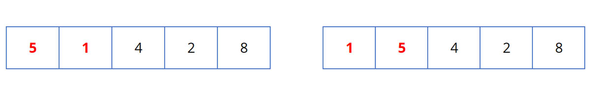
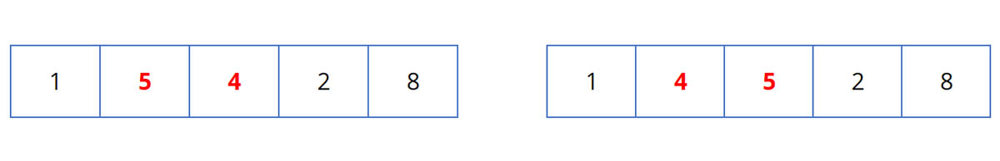
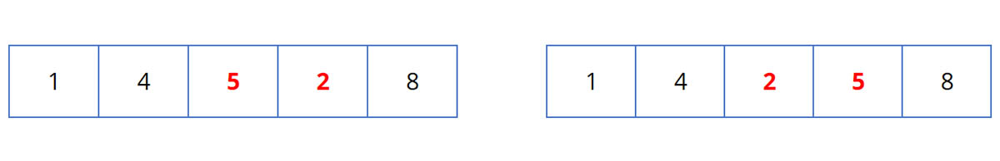
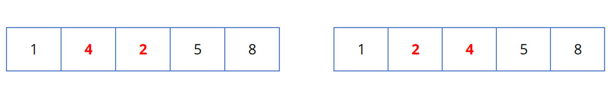
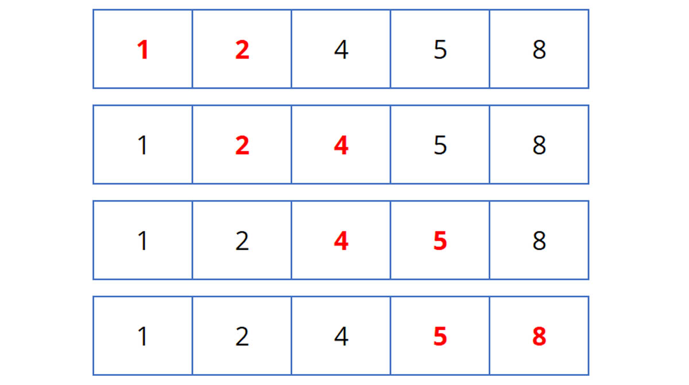

 Thuật Toán Sắp Xếp Nổi Bọt ( Bubble Sort ) :
 + Sắp xếp nổi bọt là một thuật toán sắp xếp đơn giản  Với thao tác cơ bản là so sánh hai phần tử kề nhau, nếu chúng chưa đứng đúng thứ tự thì đổi chỗ.
 + Có thể tiến hành từ trên xuống (trái sang phải) hay từ dưới lên (phải sang trái)
 
Ý tưởng : 
 + Xuất phát từ cuối dãy, đổi chỗ các cặp phần tử kế cận để đưa phần tử nhỏ hơn
Trong cặp phần tử đó về vị trí đầu dãy hiện hành, sau đó sẽ không xét đến nó ở bước tiếp theo
 + Ở lần xử lý thứ i có vị trí đầu dãy là i
 + Lặp lại xử lý trên cho đến khi không còn cặp phần tử nào để xét

Mô tả thuật toán : 
   Cho mảng : 
 Ở lần duyệt đầu tiên : 

Thuật toán so sánh hai phần tử đầu tiên và hoán đổi vị trí cho nhau vì 5 > 1 :

 ![img_1.png]    
Hoán đổi vị trí 5 và 4 cho nhau vì 5 > 4 

![img_4.png]    
Hoán đổi vị trí 5 và 2 cho nhau vì 5 > 2

![img_6.png]    
So sánh 2 phần tử cuối thấy 8 > 5 nên không thay đổi vị trí
 
 Ở lần duyệt thứ 2 :

Lần lặp thứ 2, so sánh 2 phần tử đầu tiên thấy 1 < 4 nên không hoán đổi vị trí của chúng.

Hoán đổi vị trí của 4 và 2 cho nhau vì 4 > 2.

![img_8.png]    

Tiếp theo, so sánh thấy 4 < 5 nên không thay đổi vị trí
So sánh thấy 5 < 8 nên không thay đổi vị trí

Bây giờ, mảng đã được sắp xếp, nhưng thuật toán của chúng ta không biết liệu nó đã hoàn thành hay chưa.

Thuật toán cần một lần lặp qua toàn bộ mà không có bất kỳ sự hoán đổi nào để biết nó đã sắp xếp thành công.

Tại lần lặp thứ 3 : 

Lần lặp thứ 3 này, chương trình kiểm tra 2 phần tử liền kề của mảng nhưng không cần phải thay đổi vị trí lần nào.
Kết thúc vòng lặp.